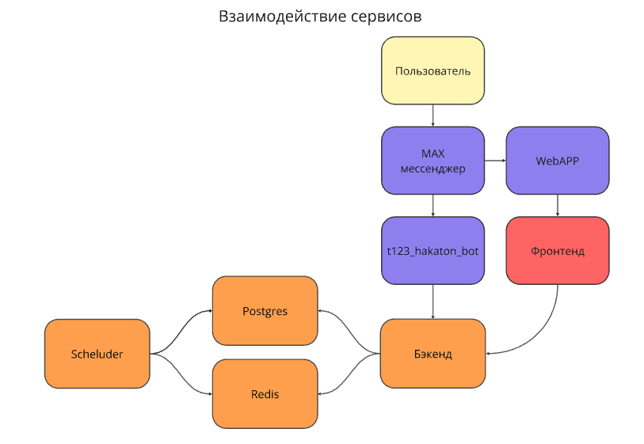

# 🍿 Бэкенд

## 🤖 Технологии

### 1. **Python как связующее звено**

**Причина выбора:**
- Python - высокоуровневый, выразительный и легко читаемый язык с богатой экосистемой, особенно в области системной автоматизации, сетевого взаимодействия и интеграции.
- Он идеально подходит для «склейки» разнородных компонентов: запуска внешних утилит, обработки их вывода, взаимодействия с БД, веб-API и очередями сообщений.
- Большое количество готовых библиотек ускоряет разработку и снижает риски ошибок.

---

### 2. [PostgreSQL](https://ru.wikipedia.org/wiki/PostgreSQL) как СУБД

**Причина выбора:**
- PostgreSQL - надёжная, мощная и расширяемая реляционная СУБД с отличной поддержкой ACID, транзакций и сложных запросов.
- Отличная интеграция с Python и ORM (в частности, с SQLAlchemy), а также зрелые инструменты репликации и резервного копирования повышают отказоустойчивость системы.

---

### 3. [Redis](https://ru.wikipedia.org/wiki/Redis)

**Редис** - это CУБД класса NoSQL с открытым исходным кодом. \
Используется для хранения данных состояний пользователей бота (например, последовательного ввода в диалогах).

**Почему он?**
- Открытый исходный код
- Молниеносная скорость (всё хранится в оперативной памяти)
- Простота использования
- Масштабируемость

---

### 4. **[FastAPI](https://github.com/fastapi/fastapi) как веб-сервер**

**Причина выбора:**
- FastAPI - современный, быстрый и асинхронный веб-фреймворк с автоматической генерацией OpenAPI/Swagger-документации и встроенной валидацией через Pydantic.
- Отлично подходит для построения RESTful API для управления сканами (запуск, статус, получение результатов).
- Нативная поддержка `async/await` упрощает интеграцию с асинхронными компонентами (NATS, SQLAlchemy async, etc.), что критично для масштабируемости и отзывчивости.

---

### 5. **SQLAlchemy как ORM**

**Причина выбора:**
- SQLAlchemy - самая зрелая и гибкая ORM для Python, предоставляющая как высокоуровневый (declarative), так и низкоуровневый (Core) доступ к БД.
- Поддержка асинхронного режима (через `asyncio` и `asyncpg`) позволяет эффективно взаимодействовать с PostgreSQL в рамках FastAPI и FastStream.
- Гибкость маппинга и поддержка сложных запросов упрощают работу с отчётами, особенно при необходимости агрегации или фильтрации результатов сканирования.

---

### 6. **Dishka как DI-фреймворк**

**Причина выбора:**
- Dishka - современный, лёгкий и быстрый DI-контейнер для Python с поддержкой асинхронности и вложенных контекстов (scoped dependencies).
- Позволяет явно декларировать зависимости (например, сессии БД, клиенты NATS, конфигурации), делая код тестируемым и модульным.
- Особенно полезен в архитектуре с несколькими компонентами (веб-сервер, воркеры), где одни и те же сервисы должны инстанцироваться по-разному в зависимости от контекста.

---

### 7. **TaskIq как планировщик**

- **Асинхронная природа** — Taskiq изначально разработан для работы с `async/await`, что делает его естественным выбором для современных асинхронных Python-приложений.
- **Поддержка распределённого выполнения задач** — позволяет запускать задачи на удалённых воркерах, что обеспечивает масштабируемость и отказоустойчивость.
- **Гибкая система сериализации** — основан на Pydantic, что гарантирует типобезопасную и предсказуемую передачу данных между отправителем и исполнителем задачи.
- **Встроенная поддержка расписаний** — предлагает механизм периодических и отложенных задач без необходимости подключать отдельный планировщик.

---

### Сводка: почему такая архитектура эффективна?

Эта комбинация технологий создаёт **модульную, масштабируемую и поддерживаемую систему**:
- **FastAPI** обеспечивает современный и быстрый API.
- **PostgreSQL + SQLAlchemy** обеспечивают надёжное и гибкое хранение данных.
- **Dishka** делает всю логику тестируемой и чётко структурированной.
- **TaskIq** добавляет гибкость в автоматизацию без усложнения инфраструктуры.
- `black` `isort` `ruff` `mypy` как контроль качества кода

---

## 👷 Структура

```
maxhack
│
├───bot - БОТ личной персоной
│   ├───handlers - Обработчики
│   ├───middlewares - Мидлвари
│   └───widgets - Кнопочки и клавиатура
│
├───core - Получение данных из БД, обращения к infra.database
│
├───di - Дишка
│
├───infra - Всё о БД, Алхимия, sql-запросики
│   └───database - БД, контекстные менеджеры и крафт асинхронных сессий
│       ├───models - Моделки
│       └───repos - Репозитории
│
├───logger - Логирование
│   ├───bot - Логи бота
│   └───web - Логи API
│
├───scheduler - Планировщик и т.д
├───utils - всякое)
│
└───web - API и всё что с ним связано
    ├───routes - Запросы в API
    ├───schemas - Схемы веб-API, Валидация payload, очереди
    └───static - Пустая папка и одинокий __init__
migrations - Миграции
```

---

## 🤝 Взаимодействия




## Docker

### Локальный запуск

1. Всё внутри докера:
    ```bash
    docker compose up --build -d
    ```
    ```bash
    docker compose up --build -d api
    ```
2. Запуск из IDE:
    1. Поднять psql и redis:
        ```bash
        docker compose --env-file=.env run --remove-orphans -d -p 5432:5432 database
        docker compose --env-file=.env run --remove-orphans -d -p 6379:6379 redis
        ```
    2. Запускать из `vkmax-hackathon/backend`:
        ```bash
        python -m maxhack.bot
        python -m maxhack.web
        python -m maxhack.scheduler
        python -m maxhack.broker
        ```
